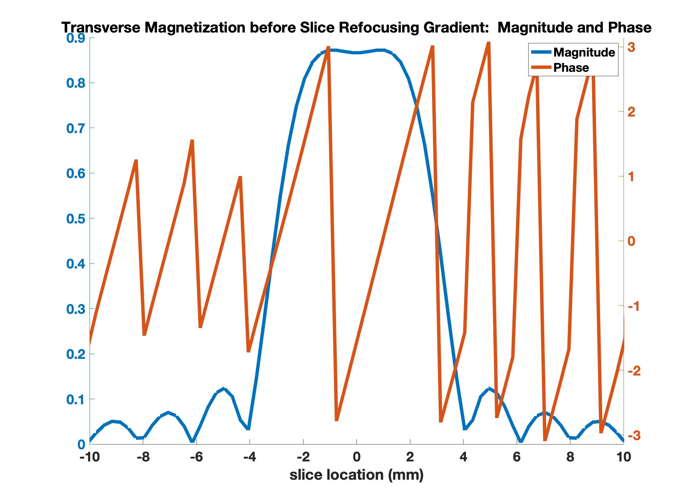
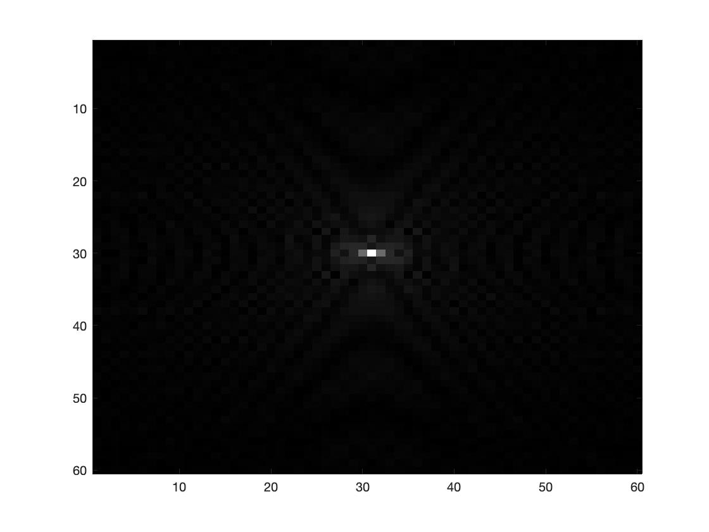
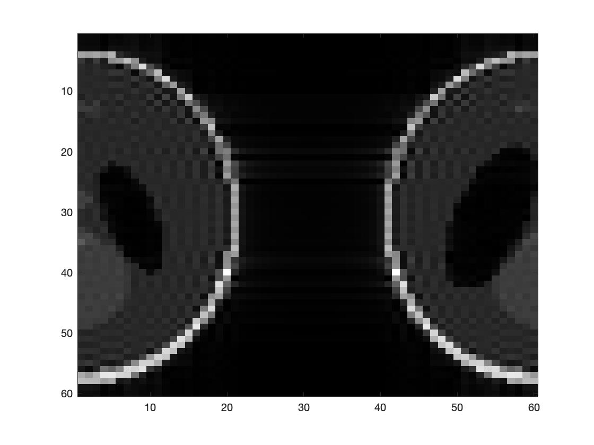
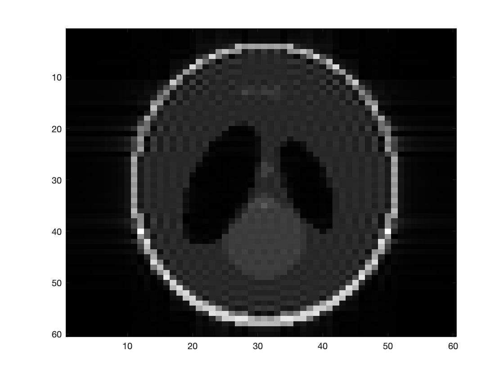

# Bloch Simulations
  A fundamentals project showing how to break down slice-select excitation in Magnetic Resonance Imaging
  (Note:  all of my planar gradients are rectangular instead of trapezoidal) 
## slice selection
This file path relies on the following files in the blochSimulations directory:
  1. getSincEnvelope_fa.m:  creates a time-varying b1 field for a given gyromagnetic ratio, specified duration, number of timepoints within that duration, 
                            time-badwidth-product, and flip angle. the output for each timepoint is in tesla. 
  2. func_sliceSelection.m:  carryies out the slice selection on a given set of linear spatially sorted spins along the slice's direction.  It relies on
                            the following input:
                            B1e (from getSincEnvelope_fa.m)  the  (1 x number of RF timepoints)  array which holds the B1 strength for each timepoint. 
                            sliceDir:  a (1 x number of slice points) array detaliing the slice location (in mm) for each spin).  
                            RFBW:  the excitation bandwidth of the B1e in Hz. 
                            sliceThickness:  the thickness we aim to excite. 
                            RFDur (same as for the getSincEnvelope_fa function):  RF's duration.
                            M0:  (number of slice points x 3) array that detail the initizl magnetization  for each spin (each spatial point has Mx, My, and Mz). If
                            we were starting from thermal equilibrium, each slice point would have its magnetization be [0 0 Mequilibirium]' where Meq is the    equilibrium       value. 
                            gamma:  gyromagnetic ratio (%rad/s/T.)
                            sliceOffCenter (mm):  the off isocenter excitation.
                            RFPhase0:  the Phase of the RF pulse.  
                            Meq:  similar to M0, but detailing the equilibrium magnetization for each spin.  
                            T1/T2: (seconds) recovery/relaxation constants.
                            dFArr:  (1 x number of slice points ) array detailing the off resonant frequencies along the slice select direction in Hz. 
                           
This function first will add a linear phase ramp to the B1e array: 
  B1ea = B1e;
  for n = 1 : size(B1e,2)
      B1ea(1,n) = B1e(1,n) * (cos(RFPhase0 + gamma*Gslice*sliceOffCenter*(tRF(1,n))) + 1i*(sin(RFPhase0 + gamma*Gslice*sliceOffCenter*(tRF(1,n)))));
  end

  B1e = B1ea ;
  
  So B1ea will be the RF pulse having the set excitaiton phase and specifying which location along the slice select axis to excite.  
  Below is an at isocenter example and another example exciting 4mm away from isocenter (both with a ninety degree flip angle):
  
  
  
  
 For each timepoint for the RF pulse, every magnetization will be exposed to a magnetic field whose components will be givine by the B1 on the transverse plane, and slice select gradient and inhomogeneity along the longitudinal axis as illustrated below:
 
 
These components change at each time point as the B1 changes throughout time (we only have flat-top gradients during this time and we don't have the spins moving in this simulation, but please feel free to adjust so if you'd like). 
Output of this function, M, is a (number of slice points x 3 x number of RF time points) matrix that holds the magnetization components for every slice point, for each time point of the excitation.  The final time point holds the through-slice magnetization distribution *before* the upcoming refocusing: 

  3. func_sliceSelRef.m:  Refocuses the spins from the final RF timepoint of the previously mentioned function.  Its parameters are:  
                          RFDur: RF's duration.  Just used to know so that the lobe will have a flat top at half of that duration. 
                          RFBW:  the rf's bandwidth, just as before, in Hz.
                          sliceThickness:  the slice thickness in mm.
                          B1e: The B1 field from function number one:  it's only used to know how many time points will exist.  We use half of the timepoints used in func_sliceSelection.m.  
                          MLast:  The last timepoint from the previous function (displayed in the picture posted above).  becaues it's the last time point, its 
                          dimensions are (number of slice select points x 3). 
                          sliceDir:  same as above: the location (in mm) of each spin arranged along the slice select's direction. 
                          Meq:  same as before:  a (number of slice points x 1) matrix that gives each spin's equilbirium value.  
                          T1, T2:  in seconds
                          dFArr:  same as before:  array  of off-resonance values (in Hz) for each spatial locatoin along the slice direction. 
                   
Similar to the the slice selection function, each spin will precess around the magnetic field it feels, this time only feeling the slice-select's refocusing lobe in addition to the inherent off-resonance it has.  Therefore the spins will rotate around the longitudinal axis.  The final result will have the spins in phase (or mostly so).  The first image is for 0mm off isocenter and the second is for a scenario with 4mm off of isocenter both with a 6mm slice thickness. 

## planar bSSFP
This was done to understand planar k space sampling is achieved in magnetic resonance imaging.  As the title indicates, this is for a planar set of spins, so I'm assuming no variation along the slice select direction.  all spins on this spins are tipped the same flip angle to the same phase. I used a planar 2D shepp logan phantom as a "digital phantom."  Its pixel value determining what i have as the equilibrium value for each spin.  What this means is that each value of an element of the digital phantom was set to be the equilibrium magnetization value for the spin located there.  
Here is our digital phantom:

We will sample this similar to MRI to get a "low resolution" image of this digital phantom, helping us appreciate concepts of phase-encoding and frequency encoding. 
This example had a uniform T1, T2, and a manually set off-resonant distribution.  
lengthAlongRO and lengthAlongPEy tell us the width that exists in the actual physical space of the digital phantom in mm.  W
With the exception of the digital phantom and uniform excitation on this planar data set, everything else is done as if we were imaging an actual object:
  * We control the number of readout points and phase encoding steps(variables NPEy and NRO). 
  * We define an imaging FOV (FOVro and FOVpey)
  * We define our RO bandwidth (title Bwpp "bandwidth per pixel"). 
  * We sample at a rate of one point per dwell-time (which we know from our ro bandwidth) during out k-space acquisition.  
  * Our receiver phase must be adjusted with our excitaiton phase ... I learnt this the hard way in both simulation and at the scanner...
  * 
 We begin sampling once a steady state is achieved.  after excitation, introvoxel dephasing is applied along the phase encoding direction.  The reason why we do this is before frequency encoding is that no matter which line of k space we have, the (composite) frequency of the signal is going to be the same.  The only way to differentiat the signal is how much phase offset the spins have relative to one another.  having an offset that veries linearly for space for each TR gives us NPey different signals to solve for.  I'll show some examples from a 60 phase encodign step example (index of the phase encoding lines range from -29 to 30). 
 
 

The sequence kernel is played out on every spin, all while the spin is pursuing T1 recovery, T2 decay, and off-resonant rotation.  Here is the k-space below:

If we do not modulate the ADC with the RF phase's increase, the following occurs:  
 
 
 This makes sense.  bSSFP's kernel has a linear RF phase ramp of pi radians/repetition. Not having the ADC modulate for this phase accumulation has a linearly increasing phase by pi radians/line of k space along the phase-encoding direction.  by the linear-shift Fourier theorem, this linear phase-ramp in k-space will have a spatial shift in the image domain along the pey direction.  To accomodate for this, this added phase must be subtracted, much in the same way how the ADC is tuned to the RF's phase before it receives.  Here is the Bloch-Simulated MR image without the linear spatial shift: 
 
 
## planar SPGRE (Spoilged Gradient Recalled Echo).
This was done to understand to understand spoiled gradient recalled echo.  The spoiling is RF induced but we also do gradient dephased (even though it does seem pointless in my opinion ... but i can talk about those later ... i love RF spoiling and that works fine ... but anyway I don't want to get off topic from this code ...). 

the data set that I deal with (a 2D Shepp-Logan phantom in the published code's example ... but it could be any 2D data set) has no spins arranged along the slice direction becuase I wanted to explore how sampling a 2D k-space is done in magnetic resonance imaging.  
